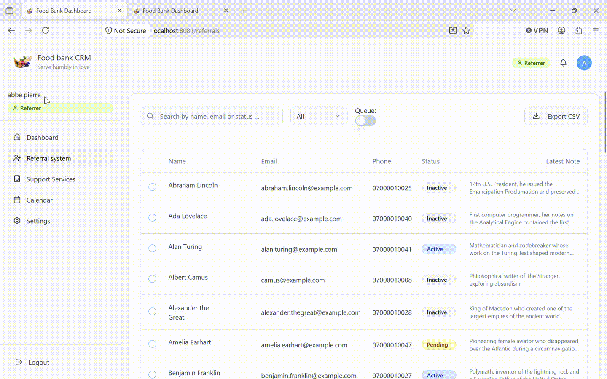

# Food bank CRM 

Full stack infrastructure to support food banks, referrers, volunteers and beneficiaries

This project is built with:
- PostgreSQL
- Vite
- TypeScript
- React
- Shadcn-ui
- Tailwind CSS

Look and feel:

- [User sign-up and approval process](assets/Admin-approve-user.gif)
- [Organisation management](assets/Admin-org-manage.gif)
- [Logs](assets/Admin-logs.gif)
- [Current contact referral](assets/Contact-current-refer.gif)
- [How the process works when beneficiaries collect food](assets/Contact-allotment.gif)
- [Merging contacts](assets/Contact-merge.gif)
- [Other tabs - support services, calendar and tasks](assets/Other-tabs.gif)
- [Settings for users - profile, preferences and security](assets/Other-settings.gif)

Repo limitation: Core SQL logic of adding allotment for beneficiary after approval has been removed. Table policies also removed.